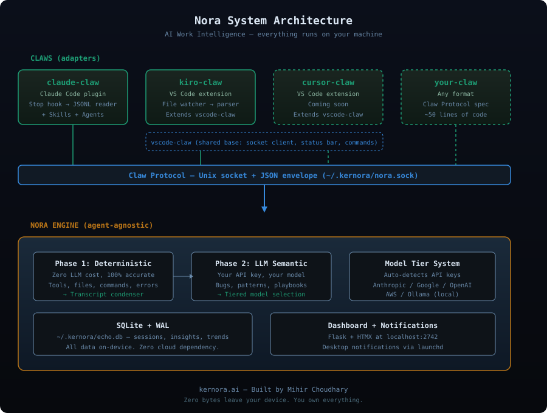

# Nora

**Your AI coding sessions contain patterns you can't see. Nora finds them.**

Every session with Claude, Kiro, Cursor, or any AI coding agent produces a transcript full of signal — recurring bugs, effective prompt patterns, architectural decisions, wasted rework. Nora extracts that signal automatically, using your own API key, on your own machine.

Zero bytes leave your device. You own everything.

[](LICENSE)

---

## What you get

**After every coding session**, Nora surfaces:

- **Recurring bugs** — the JWT race condition you've hit 7 times this month
- **Prompt patterns** — what's working, what's causing rework, how your quality is trending
- **CLAUDE.md rules** — specific project rules that would eliminate hours of repeated mistakes
- **Playbooks** — repeatable workflows extracted from your best sessions
- **Architectural decisions** — the tradeoffs you made, documented automatically

All of this appears in a local dashboard at `localhost:2742` — no cloud, no account, no subscription required.

---

## Install

```bash
curl -sf https://kernora.ai/install | bash
```

Then install a **claw** — the lightweight adapter for your coding agent:

| Agent | Claw | Install |
|-------|------|---------|
| Claude Code | [claude-claw](https://github.com/kernora/claude-claw) | `claude plugin add kernora/claude-claw` |
| Kiro | [kiro-claw](https://github.com/kernora/kiro-claw) | `ext install kernora.kiro-claw` |
| Cursor | cursor-claw | Coming soon |
| VS Code (base) | [vscode-claw](https://github.com/kernora/vscode-claw) | For claw builders |
| **Build your own** | [Claw Protocol →](docs/CLAW-PROTOCOL.md) | Any agent with transcripts |

**That's it.** End a coding session. Within 60 seconds, Nora analyzes it and notifies you.

---

## How it works

```
You finish a coding session
  ↓
Your claw captures the transcript (agent-specific)
  ↓
Unix socket → Nora daemon → SQLite
  ↓
Two-phase analysis:
  Phase 1: Deterministic extraction (tools, files, commands) — zero LLM cost, 100% accurate
  Phase 2: LLM semantic extraction (bugs, patterns, decisions) — your API key, your model
  ↓
Desktop notification: "Nora: 2 bugs found, 1 playbook extracted"
  ↓
Dashboard at localhost:2742
```

**Privacy model:** In BYOK (Bring Your Own Key) mode, transcripts never leave your machine. The LLM call goes directly from your device to your API provider. Kernora servers are not in the path. This is verified by network audit during install.

---

## Architecture

<p align="center">
  
</p>

Nora is the **engine** — it handles analysis, storage, the dashboard, and notifications. It knows nothing about any specific AI coding agent.

**Claws** are lightweight adapters that know where a specific agent stores its transcripts and how to pipe them to Nora. Each claw is a separate repo, a separate install, and typically under 200 lines of code.

```
 ┌──────────────┐   ┌──────────────┐   ┌──────────────┐   ┌──────────────┐
 │ claude-claw  │   │  kiro-claw   │   │ cursor-claw  │   │  your-claw   │
 │ (plugin)     │   │ (extension)  │   │ (extension)  │   │ (anything)   │
 └──────┬───────┘   └──────┬───────┘   └──────┬───────┘   └──────┬───────┘
        │                  │                  │                  │
        │       Claw Protocol (Unix socket + JSON envelope)     │
        └──────────────────┼──────────────────┼──────────────────┘
                           │                  │
                     ┌─────▼──────────────────▼──┐
                     │         Nora Engine        │
                     ├────────────────────────────┤
                     │  analyzer    — two-phase   │
                     │  db          — SQLite/WAL  │
                     │  dashboard   — Flask+HTMX  │
                     │  daemon      — launchd     │
                     │  notifier    — desktop     │
                     │  model-tier  — auto-select │
                     └────────────────────────────┘
                                   │
                           ┌───────▼───────┐
                           │ ~/.kernora/   │
                           │  echo.db      │
                           │  config.toml  │
                           └───────────────┘
```

---

## Model options

Nora uses your credentials. You pick the model. You pay the provider directly.

| Model | Provider | Cost/dev/month* | Quality |
|-------|----------|-----------------|---------|
| Sonnet 4.6 | Anthropic | ~$0.45 | ★★★★★ Best for deep extraction |
| Haiku 4.5 | Anthropic | ~$0.18 | ★★★★ Default — strong and cheap |
| Gemini 3.1 Pro | Google | ~$0.30 | ★★★★★ Strong alternative |
| Gemini 2.5 Flash | Google | ~$0.15 | ★★★★ Good budget option |
| GPT-4o | OpenAI | ~$0.50 | ★★★★★ If you already have a key |
| Nova Lite | AWS Bedrock | ~$0.012 | ★★ Basic — 50× cheaper |
| Llama 3.2 8B | Ollama | Free | ★★ Local, no network at all |

*Estimates based on ~20 sessions/month, ~8K tokens per session.*

Nora auto-detects your available API keys and picks the best model. Or set it yourself:

```toml
# ~/.kernora/config.toml
[model]
provider = "auto"  # detects all available keys, picks best per tier
```

**Tiered model selection:** Nora uses the best available model for semantic extraction (playbooks, decisions, patterns) and a cheaper model for classification (session types, themes). If your frontier model fails, it falls back automatically.

---

## The Claw Protocol

Want to build a claw for an agent we don't support yet? The protocol is simple:

1. **Capture** the transcript when a session ends (agent-specific — this is why each claw is separate)
2. **Pipe** a JSON envelope to Nora's Unix socket at `~/.kernora/nora.sock`
3. **Done.** Nora handles everything else.

See [docs/CLAW-PROTOCOL.md](docs/CLAW-PROTOCOL.md) for the full spec. It's ~50 lines of any language.

---

## Roadmap

- [x] Two-phase analysis (deterministic + LLM)
- [x] Multi-model support (Anthropic, Google, OpenAI, AWS, Ollama)
- [x] Tiered model selection with auto-fallback
- [x] Local dashboard (Flask + HTMX)
- [x] Claude Code claw
- [x] Kiro claw (via vscode-claw base)
- [ ] Cursor claw
- [ ] Team intelligence (squad-level patterns for engineering managers)
- [ ] Trend analysis (week-over-week prompt quality, bug recurrence)
- [ ] Nora Cloud (optional — hosted dashboard, team aggregation)

---

## Contributing

See [CONTRIBUTING.md](CONTRIBUTING.md). Claw contributions are especially welcome — if you use an AI coding agent we don't support yet, building a claw for it is a great first contribution.

---

## License

[Elastic License 2.0](LICENSE) — free for personal and team self-hosted use.
Commercial embedding in a managed service requires a separate agreement.

---

Built by [Mihir Choudhary](https://kernora.ai). Claude assisted with development.

hello@kernora.ai
